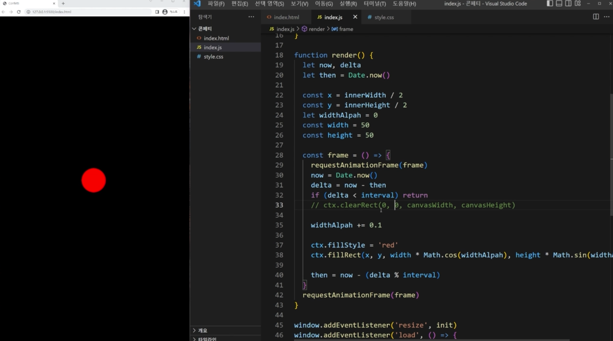

## 보일러플레이트

[코드 예제](../boilerplate/)

## 콘페티 이펙트의 핵심 원리

만드는 사람에 따라 천차만별로 구현할 수 있습니다.

clearRect에 sin,cos를 곱해줬을 때 팔랑거리는 효과가 나오는 이유는, 다음과 같습니다.
프레임 안에서 `ctx.clearRect(0, 0, canvasWidth, canvasHeight);` 코드를 지워보면 원을 그리기 때문입니다.

[코드 예제](../the-core-principle-of-confetti-effect/)

## 콘페티 파티클 클래스 만들기

[코드 예제](../implement-confetti-particles-class/)
