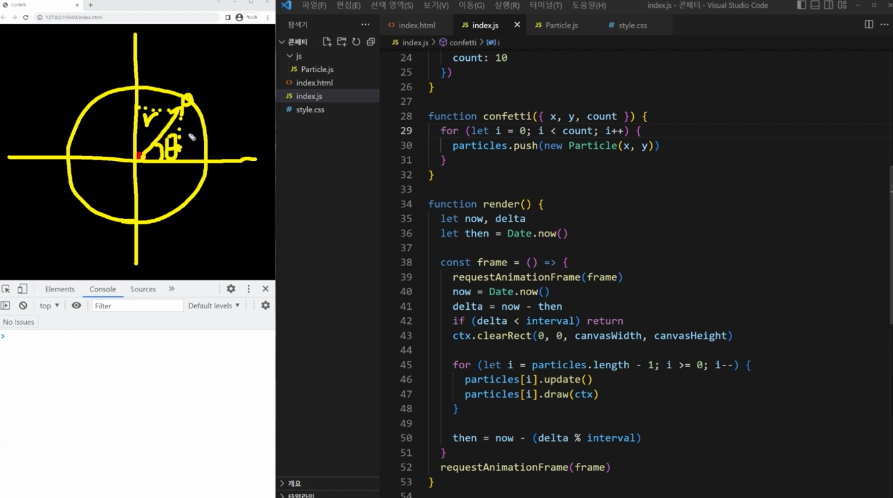
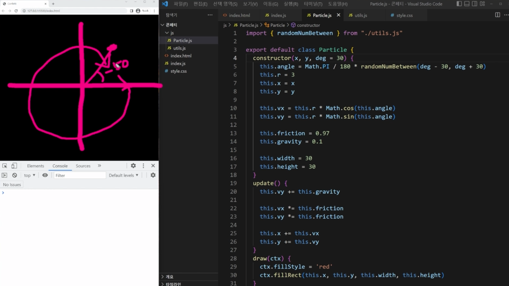

## 보일러플레이트

[코드 예제](../boilerplate/)

## 콘페티 이펙트의 핵심 원리

만드는 사람에 따라 천차만별로 구현할 수 있습니다.

clearRect에 sin,cos를 곱해줬을 때 팔랑거리는 효과가 나오는 이유는, 다음과 같습니다.
프레임 안에서 `ctx.clearRect(0, 0, canvasWidth, canvasHeight);` 코드를 지워보면 원을 그리기 때문입니다.

[코드 예제](../the-core-principle-of-confetti-effect/)

## 콘페티 파티클 클래스 만들기

화면 가운데를 중심으로 생성된 confetti particle들이 사방으로 퍼져나가면 됩니다. 
불꽃놀이 때처럼, x,y를 중심으로 사방으로 퍼져나가야 하는데 
x,y를 중심으로 원 모양으로 퍼지게 하려면 vx,vy를 cos,sin 함수를 사용해 만들어야 합니다.

어느 쪽 방향으로 어느 정도 힘을 줄지를 결정해야 합니다.

이동한 거리는 반지름(r)이고, 
결국 (`r*cosθ`, `r*sinθ`) 이동한 셈이므로 방향은 θ, 즉 각도에 의해서 결정됩니다. 
따라서 vx,vy는 한 프레임당 이동하는 위치가

- `vx = r * cosθ`
- `vy = r * sinθ`

confetti 터지는 각도는 약 -50도면 아래와 같습니다.

[코드 예제](../implement-confetti-particles-class/)

## 콘페티 파티클 클래스 만들기 2

[코드 예제](../implement-confetti-particles-class-2/)
