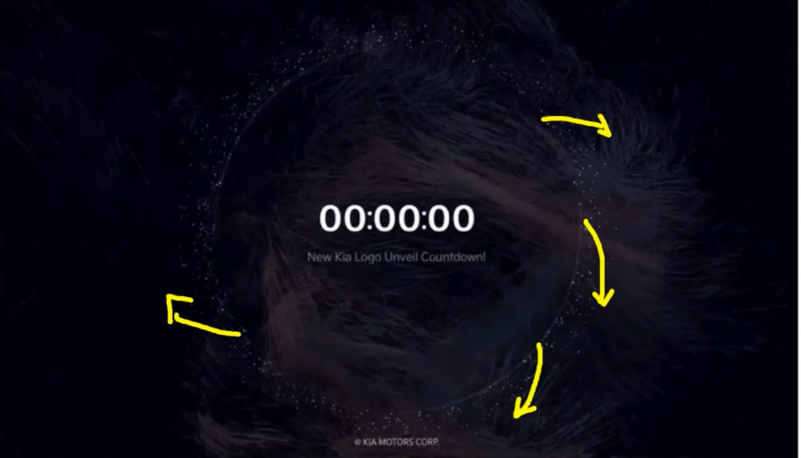
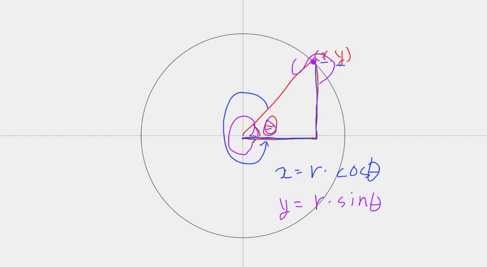
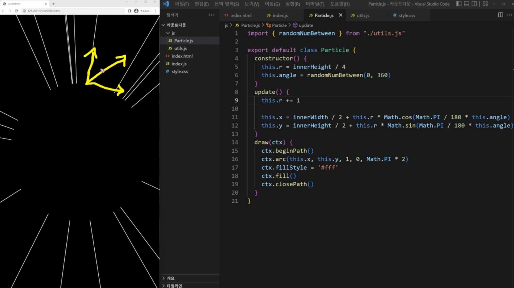
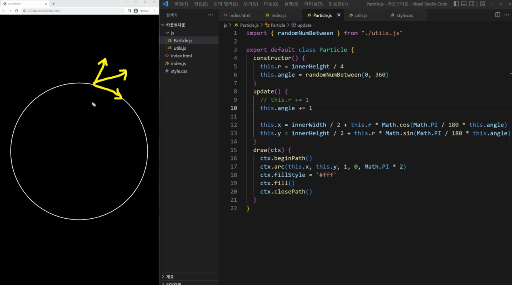
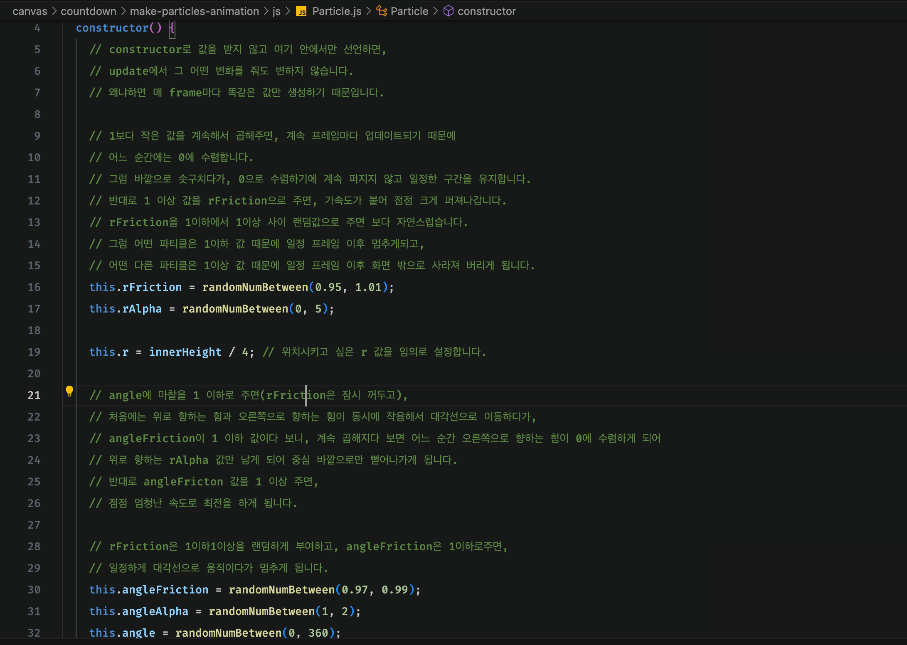

# Countdown Particles

## 기초 뼈대 구성하기

[코드 예제](../boilerplate/)

## 파티클 배치하기

파티클들이 제각기 다른 방향으로 퍼져나갑니다.

퍼져나가는 효과 전에 일단, 파티클들을 원 모양으로 배치합니다. 
원 모양으로 배치할 때는 삼각함수를 사용합니다.

x는 삼각형의 밑변이고, y가 삼각형의 높이이므로 

`cosθ = x/빗변의 길이`이므로 `x = 빗변의길이(r,반지름) * cosθ`가 된다. 
`sinθ = y/r(빗변의길이)`이므로 `y = r * sinθ`가 된다.

그럼 이때, θ가 0~360도 사이의 값을 가지게 되면 
원의 테두리에 점이 찍히게 된다.

[코드 예제](../arrange-particles/)

## 파티클 애니메이션 만들기

파티클들이 대각선 방향으로 힘을 받아서 움직입니다. 
대각선 방향으로 힘을 받으려면,

- 중심에서 바깥으로 향하는 힘과,
- 수직이 되는 힘이 함께 상호작용이 되어야 대각선으로 이동할 수 있습니다.

먼저, r에 값을 계속 더해주면 파티클이 중심에서 바깥으로 향합니다.

반대로 angle에 1씩 더해주면 파티클들이 회전을 합니다.

이렇듯 옆으로 힘을 받아서 이동하는 건 angle로, 
위로 힘을 받아서 이동하는 건 r로 구현할 수 있습니다.

마찰(friction)도 추가해줘야 보다 더 자연스럽습니다. 
마찰이 없으면 계속 같은 속도로 이동하기 때문에, 자연스럽지 않습니다.

- 이번에는 마찰을 r에 작용하는 것과 angle에 작용하는 것으로 구분해서 추가합니다.

r마찰의 경우

- 1보다 작은 값을 계속해서 곱해주면, 계속 프레임마다 업데이트되기 때문에
- 어느 순간에는 0에 수렴합니다.
- 그럼 바깥으로 솟구치다가, 0으로 수렴하기에 계속 퍼지지 않고 일정한 구간을 유지합니다.
- 반대로 1 이상 값을 rFriction으로 주면, 가속도가 붙어 점점 크게 퍼져나갑니다.

이제 opacity 값만 조절해서 자연스럽게 사라지게 만들어주면 됩니다
