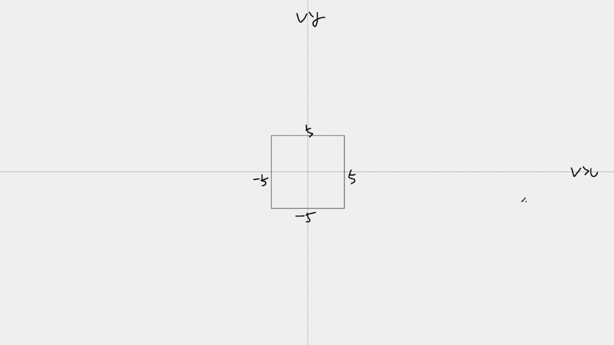
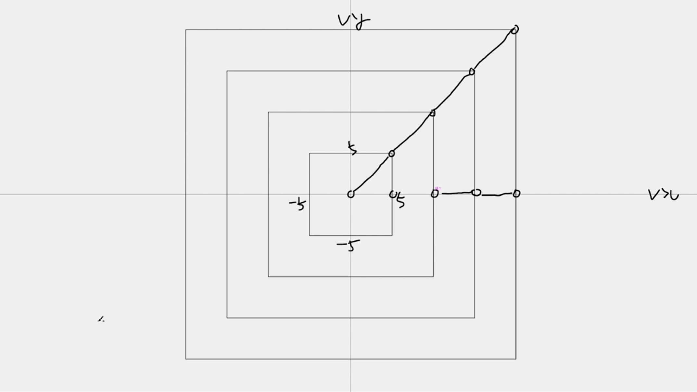
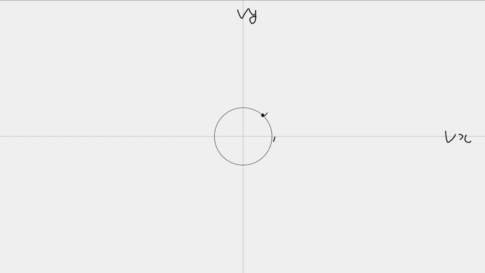
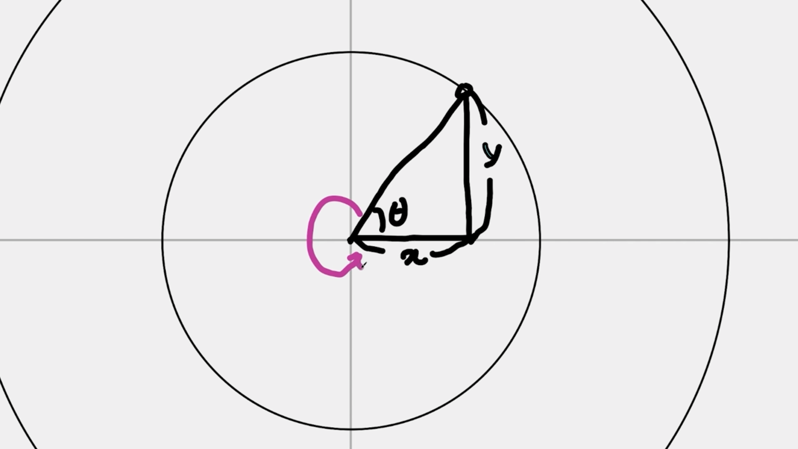
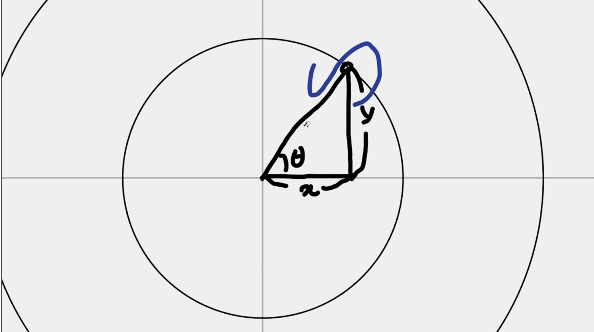
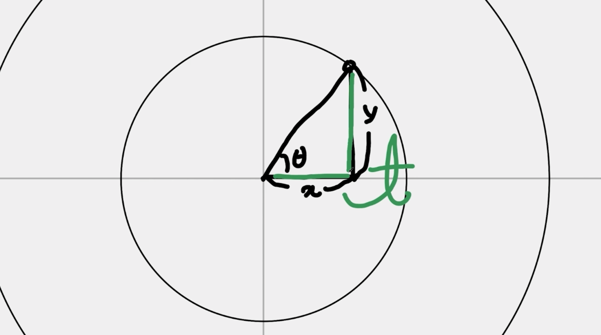
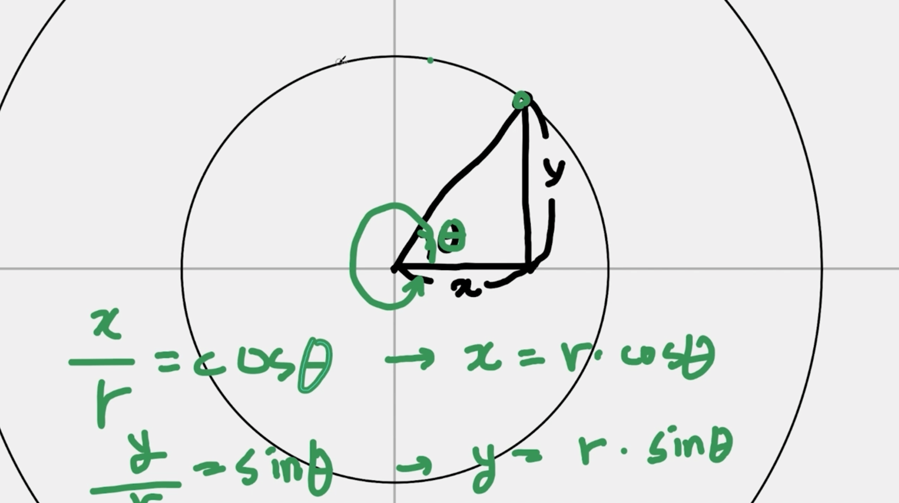

# Fireworks

## 보일러플레이트

canvas와 관련한 보일러플레이트 코드를 작성합니다.

[raw한 보일러플레이트](../boilerplate-raw/) 
[Class로 추상화한 보일러플레이트](../boilerplate-class/) 

## 파티클과 폭죽의 기본 원리

파티클과 폭죽의 기본 원리를 코드로 구현합니다.

Canvas에서 particles 배열로 입자들을 관리합니다.

처음 시작은 같은 위치에서 하되, vx,vy를 랜덤하게 부여해서 퍼져나가는 효과를 구현합니다.

이때 화면 밖으로 입자들이 사라지더라도 CPU는 계속해서 vx,vy를 적용합니다. 
그러므로 opacity가 0 미만이면 particles 배열에서 삭제해줘야 합니다.

raf에서는 매번 캔버스 크기만큼 배경색을 칠해줘서 초기화해줘야 애니메이션 효과를 구현할 수 있습니다.

[예제 코드](../basic-priciples-of-particles-and-fireworks/)

## 불꽃놀이 원 모양으로 랜덤 파티클 만들어보기

### 원 모양 원리 이해하기

이전까지는 사각형으로 퍼져나가는 것까지 구현했지만, 이번엔 원형의 폭죽 모양을 구현합니다.

vx는 -5부터 5까지, vy도 -5부터 5까지. 
vx는 x에 대한 속도를 말하는데,

- "캔버스 안에서의 '속도'란 결국 render 함수 안에서 한 프레임이 실해되는 동안 x와 y가 얼만큼 이동했느냐입니다."

이때, vy, vx가 5씩 증가하면 아래 이미지와 같이 증가하게 된다. 그래서 자연스럽게 사각형 형태로 구현되어 버리는 셈입니다.

그러므로 원형으로 퍼지게 하려면, vy,vx가 원 모양으로 그래프를 그릴 수 있으면 됩니다. 
즉, 반지름이 1이고, 원 위의 좌표를 구할 수만 있으면 됩니다.

원 위의 좌표를 어떻게 구하냐면,

θ(theta) 각을 기준으로 C를 그리면, 즉 `x/반지름` 값이 cosθ.

θ(theta) 각을 기준으로 S 모양을 그리면, `y/빗변의 길이(반지름) 값이 sinθ.

θ(theta) 각을 기준으로 T 모양을 그리면, `y/밑변길이(x)` 값이 tanθ.

즉, `x/r = cosθ` 이므로 `x = r * cosθ`가 됩니다.
`y/r = sinθ` 이므로 `y = r * sinθ`가 됩니다.

결국, x와 y 값은 θ(0부터 360도 사이 범위) 각도에 따라 x와 y값이 결정됩니다.

이제 불꽃놀이를 구현하려면, 랜덤한 θ값과, 랜덤한 r 값을 구하면 됩니다.

### 중력과 마찰 구현하기

중력이 있으면 아래로 조금씩 떨어지면서 자연스러워 보입니다.
마찰friction을 넣게 되면, 속도가 점점 0에 수렴하게 되어 더 사실적으로 구현할 수 있습니다.

[예제 코드](../implementing-circular-gravity-and-friction/)

## 꼬리(Tail Class) 만들기

지금까지 학습 내용

- particle 퍼저나가는 형태를 사각형에서 원형으로 변경하기
- 중력과 마찰을 적용해 속도 조절하기
- 브라우저 사이즈에 맞게 Particle 사이즈 조절하기

이번에는, 실제 불꽃놀이처럼 피어올라서 특정 위치에서 particle이 터지는 모션을 구현합니다.

꼬리가 피어오르도록 합니다. 
피어오르다 멈추게 하도록 마찰을 적용합니다. 
멈추는 시점에 폭죽을 터뜨립니다. 
꼬리가 피어오를 때, 투명도가 점점 0으로 감소합니다. 
일직선으로 단순히 솟아오르지 않고 꼬불꼬불거리는 모션도 추가합니다.

[예제 코드](../implement-tail-motion/)
