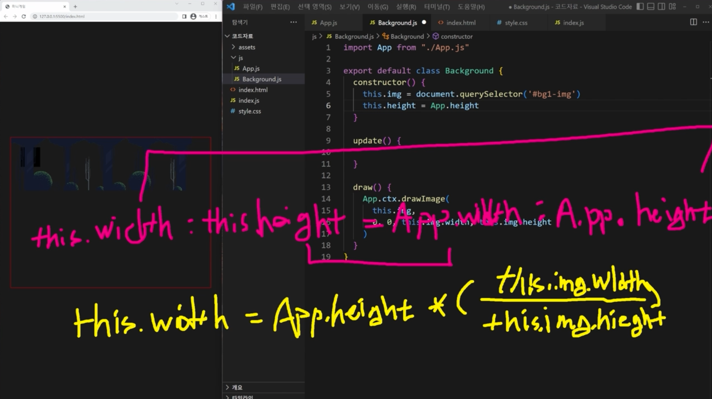
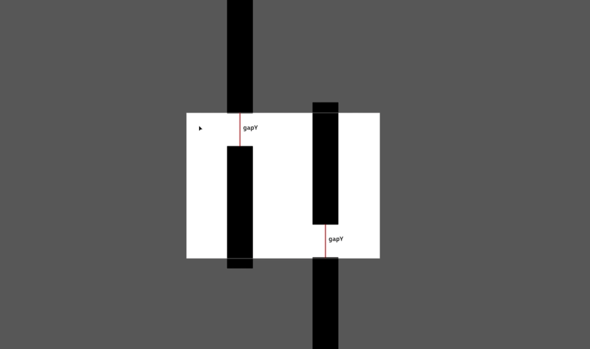
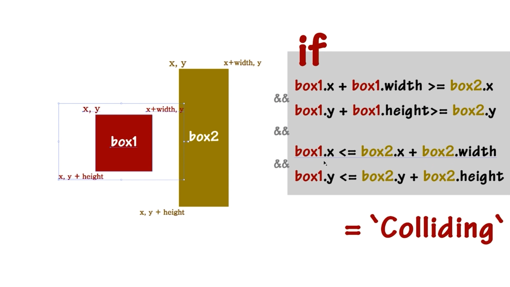

# Minigame

## 기초 뼈대 구성하기

[코드 예제](../boilerplate/)

## Background 클래스 만들기

https://itch.io/ 
인디 게임 개발 모음. => html5로 만든 게임들 볼 수 있음.

- https://itch.io/game-assets 에서 게임 관련 에셋들도 확인할 수 있음.

[코드 예제](../background/)

## 장애물 Wall 클래스 만들기 (1)

tiled 프로그램을 사용해서 에셋을 만들 수 있음.

[코드 예제](../wall-1/)

## 장애물 Wall 클래스 만들기 (2)

벽 사이 간격을 랜덤하게 줘야하며

벽의 시작 y값도 랜덤하게 부여해야 함.

- 위의 벽 y를 y1, 아래 벽 y를 y2라고 했을 때, y1만 구하면 y2는 구하기 쉬움
- y1은 최소값일 때가 자신의 height만큼 위로 갔을 때임.
- y2는 `y1 + this.height + gapY`를 더한 값임
- y1의 최대값은 오른쪽 그림임.
- y1의 최대값은 `App.height - gapY - this.height(벽 자신의 높이)`임.
- 이렇게 구할 수 있는 최소-최대 값 사이에서 y값들을 지정하면 됨.

[코드 예제](../wall-2/)

## Player 클래스 만들기

캐릭터 에셋 구할 수 있는 사이트 
[bevouliin](https://bevouliin.com/)

스프라이트 이미지 사용.

[코드 예제](../player/)

## 장애물 벽과 플레이어 간 충돌 감지

충돌한다는 건 영역의 교집합이 발생한다는 것임.

우리는 Player 클래스와 Wall 클래스 충돌을 직접 감지하지 않고. 
충돌 영역을 별도의 클래스 지정할 예정.(`BoundingBox.js`)

BoundingBox를 Player와 Wall에 각각 만들고 교집합 측정.

[코드 예제](../collision/)

## Coin 클래스 만들기
