# 밧줄 이펙트 (물리 알고리즘)

## 기초 뼈대 구성하기

js/App.js 파일에 보일러플레이트를 위한 App 클래스 생성.

[코드 예제](../boilerplate/)

## Vector 클래스 만들기

doc은 x,y만 존재하면 됨. 
xy를 그냥 `this.x=x` 이렇게 저장할 수도 있지만, 물리엔진 라이브러리들은 이걸 vector로 관리함. 그래서 우리도 Vector 클래스를 만듦.

[코드 예제](../vector/)

## Dot 클래스 만들기

Vector 클래스를 사용하면 물리 연산을 훨씬 깔끔하게 처리할 수 있다.

vel은 현재 위치와 이전 위치의 거리(oldPos - pos) (velocity, 즉 속도)

- 이를 위해 계속해서 현재 위치를 이전 위치로 setXY해줘야 함.

vel에다가 값을 꾸준히 더해주고, 이 vel을 위치에 더해주면, 이게 중력처럼 됨. gravity 변수로 처리.

- 즉, 가속도가 붙어서 마치 위에서 농구공 떨어트렸을 때 점점 빨라지게 만듬.

근데 이렇게만 처리하면, 점점 엄청나게 빨라짐. => 실제로 물리 현실은 그렇지 않음.

- 어느 순간에는 속도가 일정해짐. 이걸 처리하기 위해 friction 마찰 변수 추가.
- 즉 특정 값을 계속 곱해주다 보면 일정 속도에 수렴하게 됨. (공기 마찰력 구현)

[코드 예제](../dot/)

참고자료

- [속도 위키백과](https://ko.wikipedia.org/wiki/%EC%86%8D%EB%8F%84) 

## Stick 클래스 만들기

점을 하나 고정하고, stick으로 두 점을 연결한다. => 그럼 다른 점은 속도, 중력/마찰력 영향을 받는데 그러다보면 무한히 늘어남. 
우리는 여기서 두 점 사이 거리를 제한해두면 물리적으로 움직이는 걸 구현할 수 있음.

원래 길이를 `L`이라고 지칭하고, 다음 프레임에 실제로 늘어나거나 줄어든 길이를 `dist`라고 표현할 거임.

- `dist`는 두점사이의거리를 제한 두는 알고리즘을 적용하기 전, 말그대로 날 것의 길이임.
- `dist`에 알고리즘을 적용해서 원래 길이인 `L`로 돌어가게 하는 게 목표임.
- `dist - L = a`라고 임의로 생각해보자.

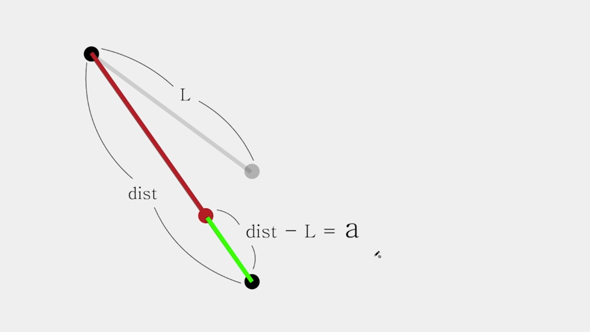

알고리즘의 핵심

- 늘어났을 때, 늘어난 만큼 반씩 잘라서 줄여준다.
- 작아졌을 때는, 작아진 만큼 반씩 잘라서 늘려준다.

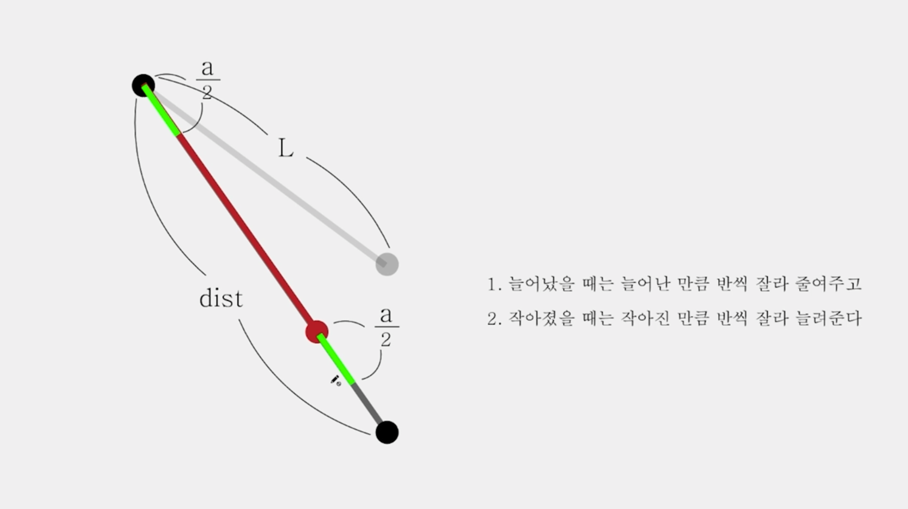

위와 같은 알고리즘에 근거하면, 원래 길이에 일치하지는 않더라도 무한히 원래 길이에 가까워지는 형태가 됨.

a를 어떻게 구할까? => 삼각형을 만들면 된다.

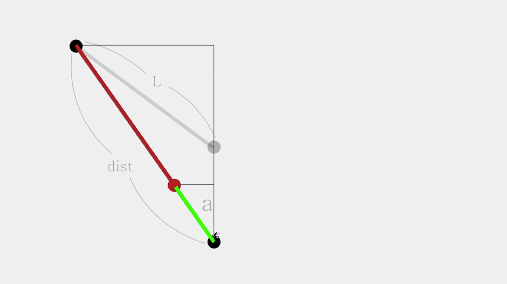

a값을 ax, ay로 나눠서 고려할거임. 점을 뺀만큼 이동시키려면 x,y 좌표 개념이 결국은 필요하니까.

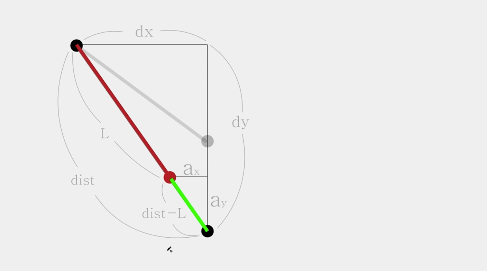

이제 sin,cos을 활용하면 됨.

ay/(dist-L) 값이 결국 Cos세타 값이 됨. (그림으로 C를 그린다고 생각하면 됨)

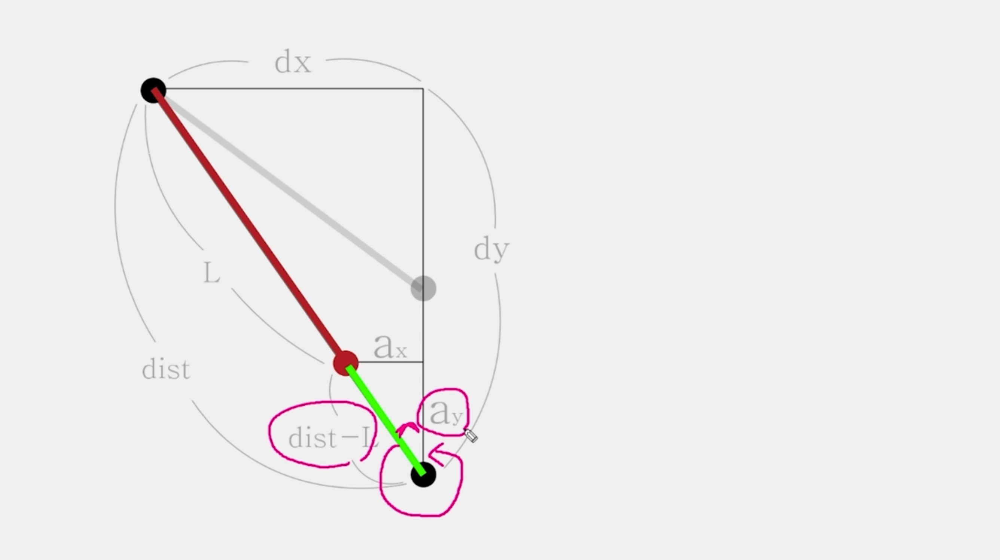

sin세타는 S모양을 그려서, dist-L/ax 값임

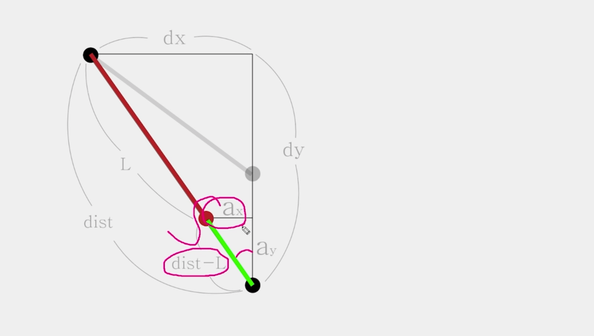

cos세타 값을 비율로 생각해보면,
ay/dist-L가 cos세타인데, => 결국 dy/dist도 cos세타값임.

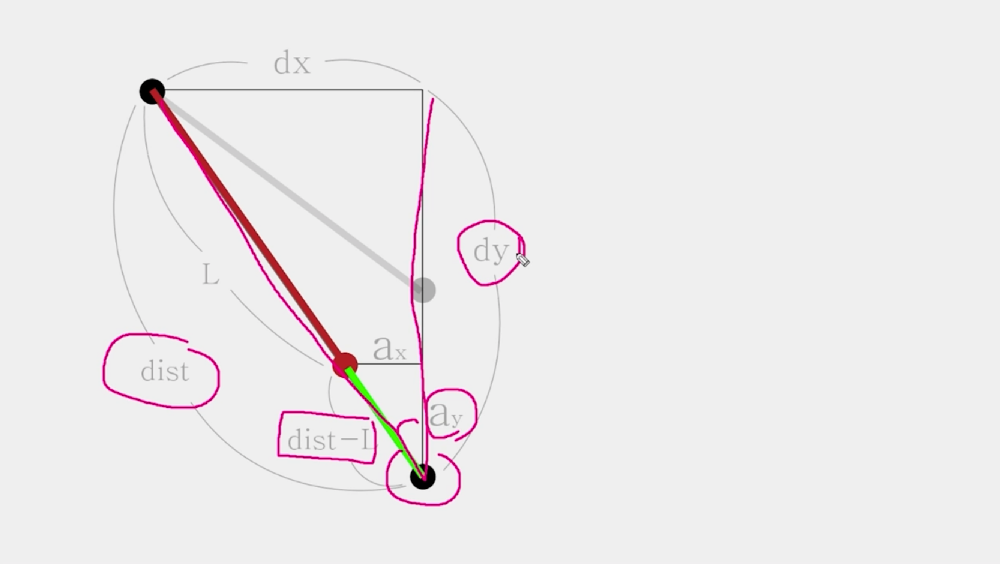

비례식으로 ay를 구할 수 있음.

ax도 sin세타로 구할 수 있음.

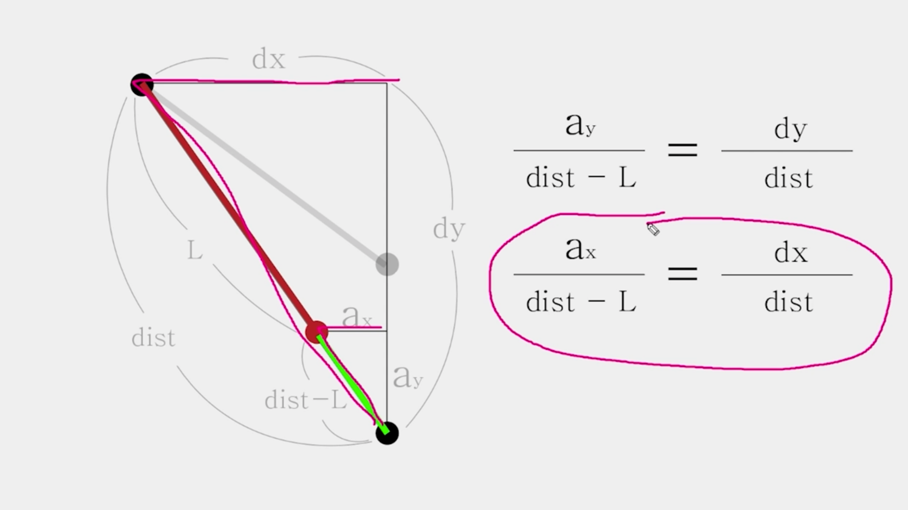

그렇게 구한 ay,ax로 => ay/2, ax/2를 각각 endPoint에다가는 빼주고 StartPoint에다가는 더해주는 작업을 매 프레임마다 반복하면 원래길이(L)에 무한히 가까워지게 된다.

L은 this.length로 관리, L은 constructor에서 구하면 됨 
dx,dy,dist는 이름 그대로. dx,dy는 업데이트 함수 안에서 구할 수 있고, dist는 피타고라스정리로 구할 수 있음.

ay는 offsetX로 변수명 변경할거임.

### 하나 더 고려해야 할 점은, 무게

만약 공들이 다른 무게를 가지고 있다면?

- 예를 들어, start가 1무게, end에 3무게면, end는 1만큼만 이동하고, start는 3만큼만 이동해서 끌려나가면 무게에 맞게 움직이는 느낌을 줄 수 있음.
- 이렇게 단순히 offset \* 0.5가 아니라 무게 비중을 반영해주면 됨.

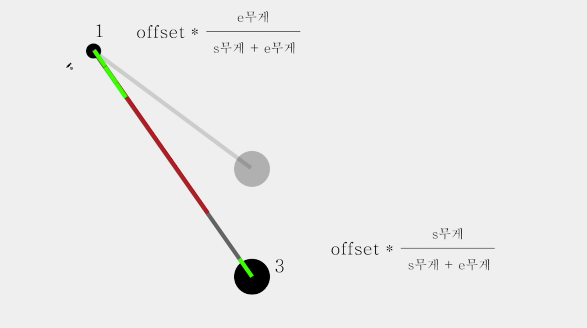

[코드 예제](../stick/)

## Mouse 클래스 만들기

마우스 근처로 공이 끌려가는 모션.

점이 마우스 반경 안으로 들어왔을 때, 끌려가려면 아래처럼 마우스 방향으로 이동해야 한다.

- 방향 벡터와 힘을 사용해서 구현할 수 있다.

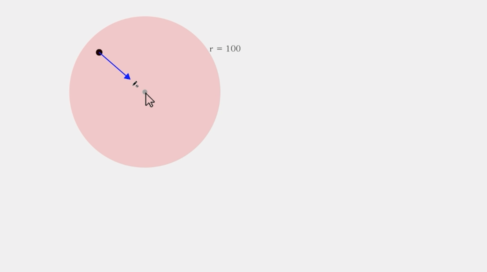

(x,y)에서 다른 (x,y)로 이동하기 위해서는 그쪽 방향으로 어느 정도 힘을 곱해주면 됨. => 방향 벡터에 힘의 크기를 곱해주면 됨.

방향 벡터를 구하는 방법은 간단함. 방향 벡터는 방향성을 가지고 있는 단위 벡터.

- 단위 벡터는 말 그대로 가장 기본 단위의 벡터. 크기를 갖고 있지 않음.

마우스와 점을 벡터로 바라보면 아래와 같다.

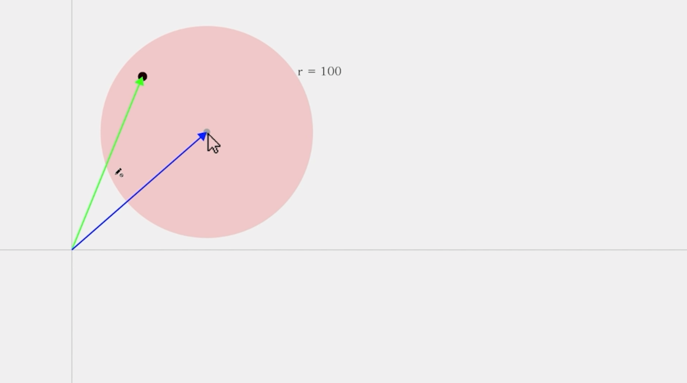

빨간 색 벡터 값을 통해, 공을 마우스 쪽으로 끌어당길 수 있다.

- 파란색 벡터에서 초록색 벡터를 뺀 값이 빨간색 벡터가 나온다.

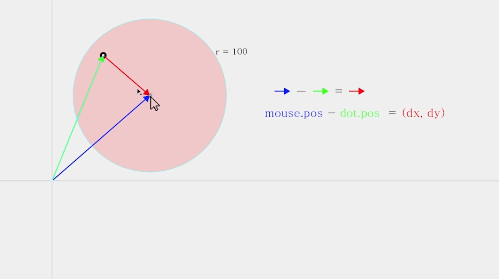

이제 이 빨간색 벡터를 크기는 없고, 방향성만 갖는 방향 벡터로 한번 변환한 다음, 원하는 힘의 크기만큼 곱해서 나오게 되는 벡터를 공에 더해주면 마우스 위치로 끌려오게 해줄 수 있다.

그럼 방향 벡터를 구하는 공식은 다음과 같다.

빨간색 방향 벡터 dy,dx를 dist로 나눠주면 된다.

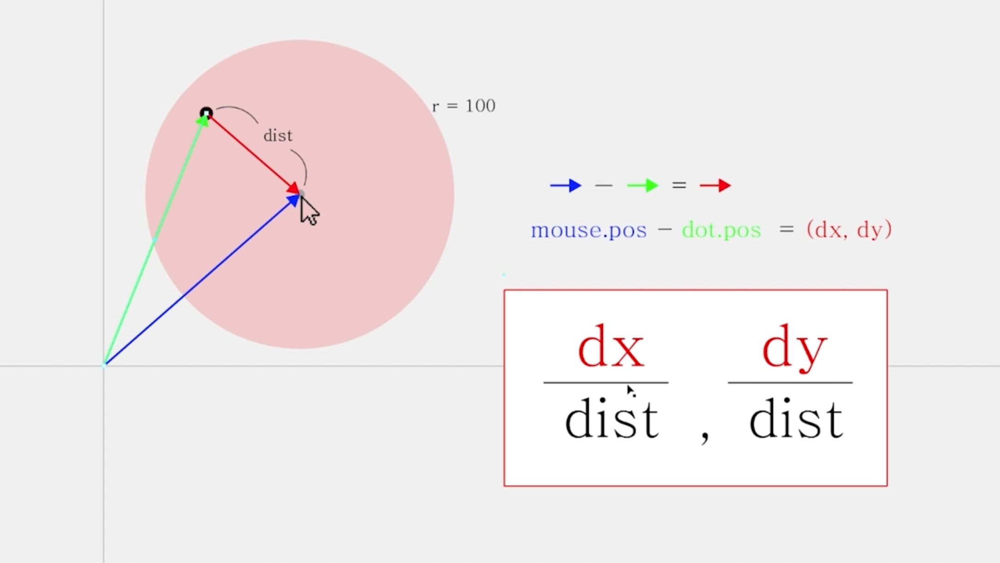

`(dx/dist, dy/dist)`라는 방향 벡터를 구할 수 있다.

- 전체 거리값 dist로 나눠줬으므로, 크기는 없고 방향성만 갖게 됨.
- 여기에 우리가 원하는 힘만 곱해주면 공을 마우스 쪽으로 끌어당길 수 있다.

방향 벡터를 구했으니, 힘의 세기만 구하면 됨.

공이 마우스 반경에 있으면 0, 공이 마우스 위치와 같으면 1

- 0과 1사이 값을 방향벡터에 곱해주면 된다.

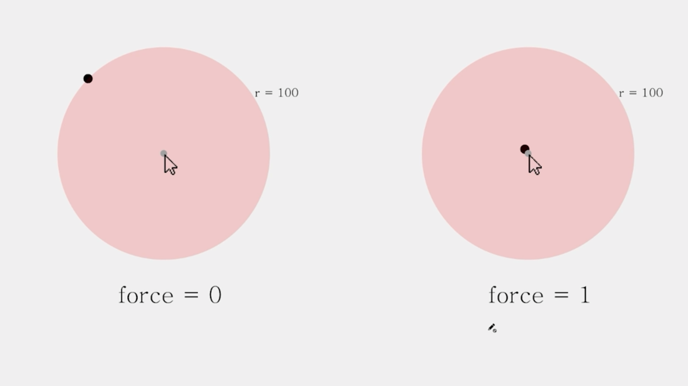

마우스에 radius가 존재하고, 공과 마우스 사이 거리 dist

- 마우스 반경 끝에 점이 있다고 하면 radius-dist가 0이 되므로, 아무런 힘이 동작하지 않고

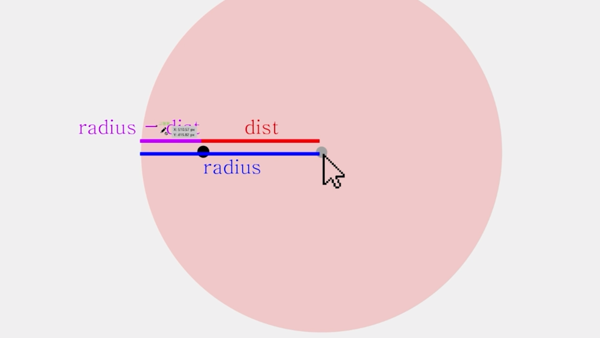

점이 마우스에 아주 가까워졌을 때는, radius-dist에서 dist가 0에 가까워지므로 radius-dist/radius는 1에 가까워져서 가장 강한 힘이 된다.

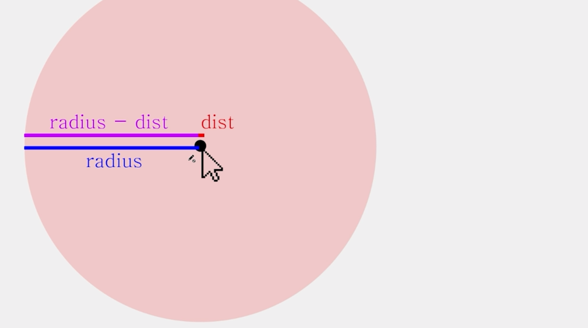

즉, 힘(force)는 아래와 같이 구할 수 있다.

- 마우스와 점 사이 거리가 가까우면 dist가 0에 가까워지므로 힘이 1에 가까워지고
- 마우스와 점 사이 거리가 멀면, dist가 radius에 가까워지므로 힘이 0에 가까워지고

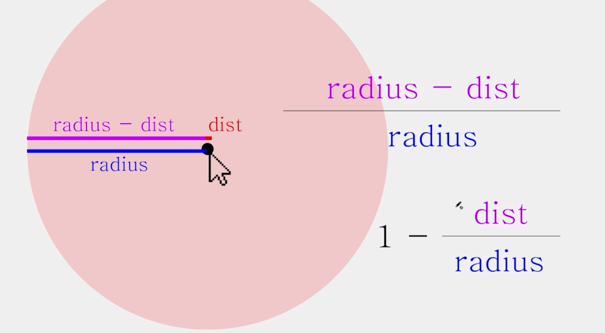
