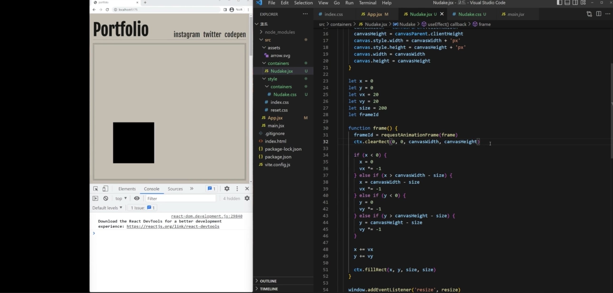

https://www.nudake.com/

특정 조건마다 vx에 -1을 곱해주면 방향을 바꾼다. 
그 vx와 vy를 x,y에 각각 더해주고, 
그걸 fillRect할 때, x,y로 사용하면 사각형이 계속 캔버스 틀 안에서 충돌하며 움직이는 걸 구현할 수 있다.

붓으로 칠하는 게 되려면, 
이전 마우스 원과 지금 마우스 원이 붙어 있어야 한다. 
둘이 떨어져 있으면 점을 찍는 게 되어 버린다.

그럴려면, 이전 점과, 현재 점의 좌표를 구하고, 
둘의 거리를 구해서, 거리만큼 촘촘하게 원을 추가로 채워넣듯이 그려주면 된다.

두 점 사이의 각도를 세타 값일 때, 
prevPos와 nextPos의 각도가 결국 개별 점들의 각도와 비율이 맞으므로

이미지 잘 보이게 하는 원리

css background-size를 cover로 하고 position:center로 하거나 
object-fit:cover를 한다는 의미는 뭐냐면

위 그림처럼 확대했을 때 이미지 비율 깨지지 않고 꽉 채운다는 의미임.

- 높이 또는 너비 중 하나가 딱 맞을 때까지 이미지 비율 깨지 않고 확대.

캔버스에서 이걸 drawImage할 때 구현하려면? css가 아니라 js로 하고 있어서 별도로 적용해줘야 해.

이미지를 아래처럼 빨간색 틀로 0,0부터 canvasWidth,canvasHeight까지 잡아두고(크롭하다?) 확대를 하면 됨.

이전에 했던 것처럼 drawImage할 때 중간에 4가지 인자(sx,sy,swidth,sheight)를 추가로 넣어주는 방식으로 해결.

총 4가지 경우의 수

- 캔버스가 가로로 길고, 이미지가 세로로 길거나 
- 캔버스가 가로로 길고, 이미지가 가로로 길거나 
- 캔버스가 세로로 길고, 이미지도 세로로 길거나 
- 캔버스가 세로로 길고, 이미지가 가로로 길거나

- 좌측상단 예시 : 이미지의 가로와 일치하는 시점이 object-fit:cover가 되는 시점(크롭할 시점)
- 우측상단 예시 : 이미지의 높이와 일치하는 시점이 object-fit:cover가 되는 시점(크롭할 시점)
- ...

ir은 ImageRatio의 줄임말. ir은 imageWidth / imageHeight한거임 (iw / ih)

cr은 CanvasRatio의 줄임말. cw(CanvasWith) / ch(CanvasHeight)

그럼 위 이미지에서 규칙성을 구할 수 있음.

- 우측상단/우측하단 : ir이 cr보다 큰 경우. sw가 iw(Image Width)와 같음. s가 크롭할 영역이라고 생각하면 됨.
- 좌측상단/좌측하단 : ir보다 cr이 더 큰 경우, 크롭할 영역인 sx,sy,sw,sh (sh가 ih와 일치)

그럼 우측 사례에서
iw === sw라는 걸 알았으니까, sh는 어떻게 구할까? 비례식으로 `sw : sh = cw : ch` 
sw,sh는 캔버스 가로/세로와 비율이 같으므로.

좌측 사례에서는 sh === ih라는 걸 알고 있고, cw,ch는 이미 알고 있는 거니까.
