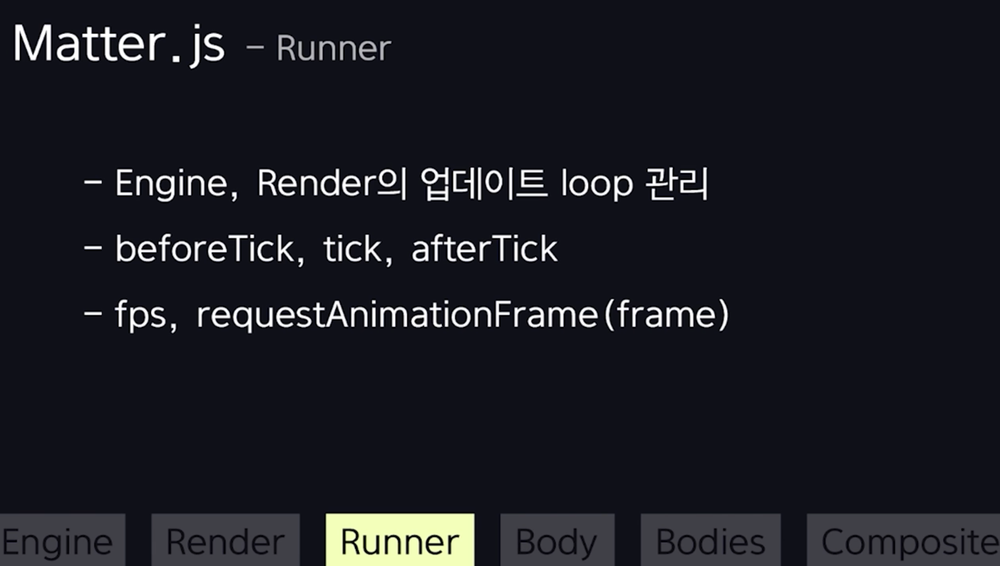
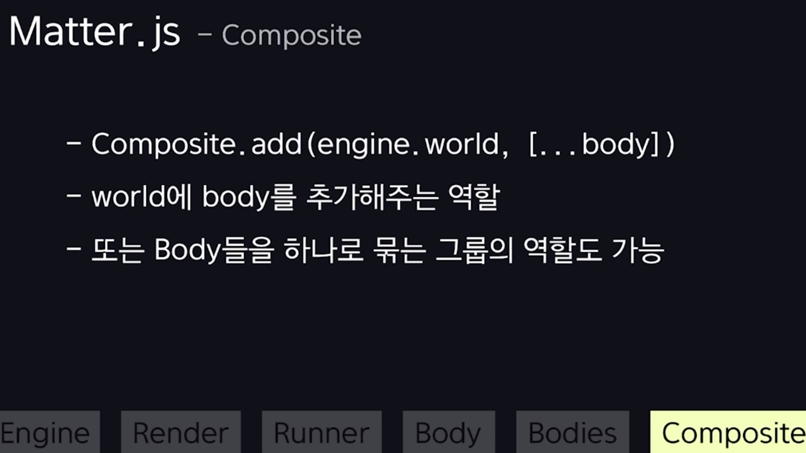

# Matter.js

https://brm.io/matter-js/docs/

## Matter.js - Engine module

Engine 모듈은 가장 먼저 선언이 필요하다.

물리 시뮬레이션을 담당.

밧줄 물리 엔진 구현할 때, 밧줄 오차를 줄이기 위해 update를 for문으로 여러 번 돌리거나 했었음.

- Engine의 각각의 물리 단위를 뜻하는 body들의 전체 list들을 관리한다. 동시에 이 단일 body들의 위치,속도,충돌 등을 수학 연산들을 담당하는 핵심 모듈임.
- gravity도 있고, enableSleeping이라고 해서 점점 거리가 가까워져서 0에 가까워지면 점점 실행을 멈추게 한다든지. 퍼포먼스에 도움을 주는 기능들이 있다. 밧줄 오차 줄이기 위해 for문 돌았던 것도 positionIterations 같은 걸로 구현하는 게 존재함.

Engine을 세팅해줬다면, 그 다음이 `Render`임.

## Matter.js - Render module

Engine이 물리적 계산을 담당했다면, render는 계산된 값들을 모아서 시각적으로 표현해주는 모듈임.

- canvas의 전체적인 세팅도 담당을 함. (dpr 세팅했던 것도 전부 여기서 담당.)

render 탭에는 show로 시작하는 엄청 많은 메서드들이 존재한다.

- 단순 문서 뿐만 아니라, 디버깅해볼 수 있는 옵션들도 다양하게 제공해준다.

## Matter.js - Runner module

이전에 frame 함수 직접 만들고 했던 과정들을 담당한다.

## Matter.js - Body module

이전에 밧줄 플젝에서 draw 메서드를 실행하지 않은 Dot 클래스라고 생각하면 된다.

생성된 하나의 body는 위치, 속도, 힘, 질량 등을 가짐.

## Matter.js - Bodies module

우리가 원하는 2d 형태는 대부분 이 Bodies 모듈로 구현할 수 있다.

## Matter.js - Composite module

우리가 만든 body들을 엔진 월드에 추가해주는 역할을 한다.

## Matter.js - Mouse module

Mouse를 사용해 현재 position을 쉽게 알아낼 수 있음. Mouse로만은 상호작용 불가능.

- MouseConstraint가 필요함.

## Matter.js - MouseConstraint

각 Body와 상호작용할 수 있게 해준다.

## 삼각함수를 활용해서 Ground를 직접 만들자.

Ground는 직접 만들어줘야 한다. 
Body는 현실세계로 치면, 안에 아무것도 넣을 수 없는 속이 꽉찬 골프공 같은 거임. 
그래서 수학공식을 써서 직접 만들어 줄 예정.

사각형을 이용해서 동그라미를 구현하려면.

원의 중심으로 각을 여러개(즉, 다각형으로)로 만들면 된다. 4각형 6각형. ... 10각형

선분을 segment라고 한다.

- segment가 6개면, 직사각형을 60도 간격으로 isStatic: true에 rectangle body 6개를 일정한 간격으로 배치.
- segment가 많아지면, 즉, rectangle body를 촘촘하게 배치해주면 나중에 이 안에서 create된 box들이 밖으로 나가지 못하고 안에 있으므로 점점 매끈해진다.

6각형을 먼저 예시로 생각해보면.

먼저 6각형을 만들기 위해 6개의 꼭짓점을 만들어야 한다.

- 여기서 x,y 값은 시작지점이 아니라 centerX, centerY다.

그래서 for문을 통해 아래와 같이, 사각형을 그려주기만 하면 된다.

cos,sin값을 사용해서 원 위에 있는 x,y 좌표를 구할 수 있다.

x값은 c그리듯이 radius \_ cos() 
y값은 s그리듯이 radius \* sin()

규칙적으로 구해주기 위해서 세타()값이 0도일때, 60도일때,120도일때, 이런식으로 늘어나면서 구해주면 된다.

height를 구하려면? => 여기도 삼각함수로 쉽게 구할 수 있다.

반으로 자른 세타는 세타/2가 되고. radius도 알고 있으므로. 
탄젠트tan를 사용해서 구할 수 있다.

## IntersectionObserver

