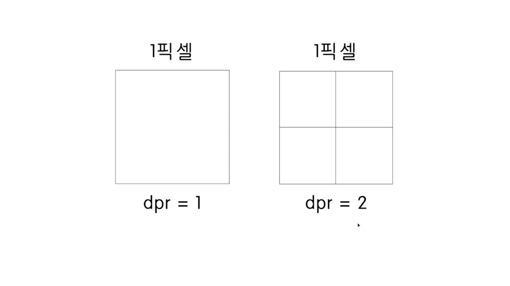
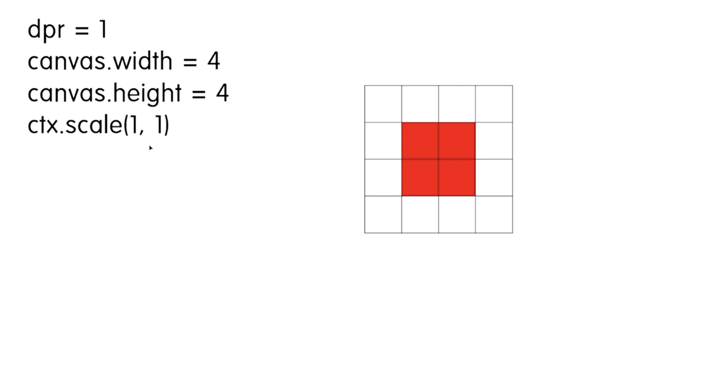
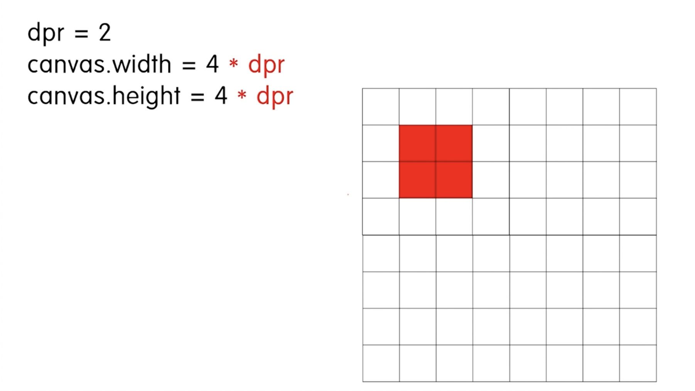
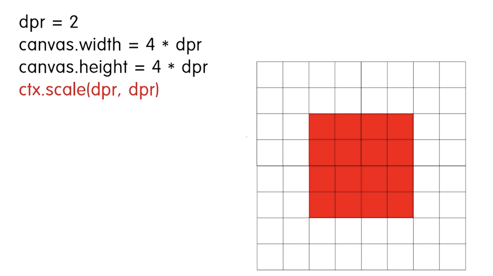
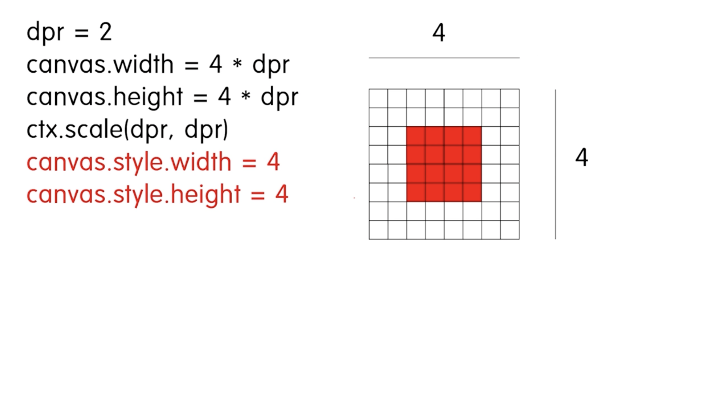
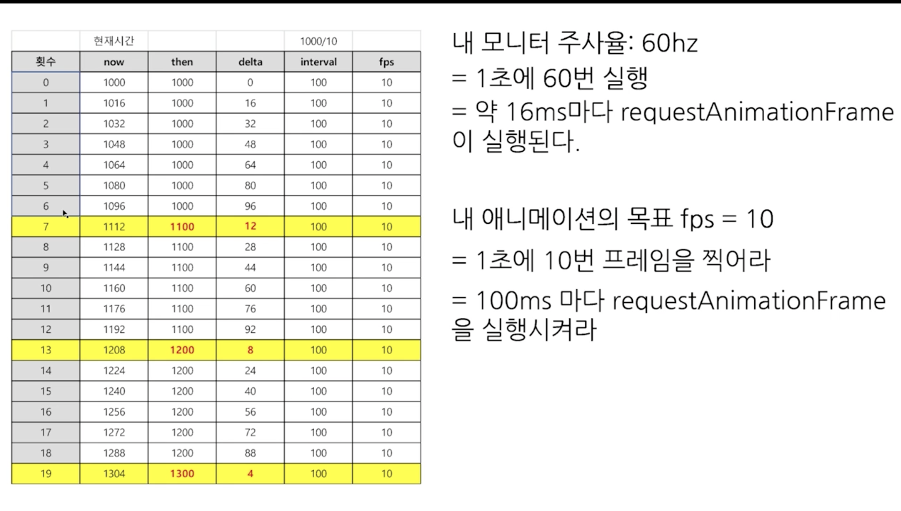
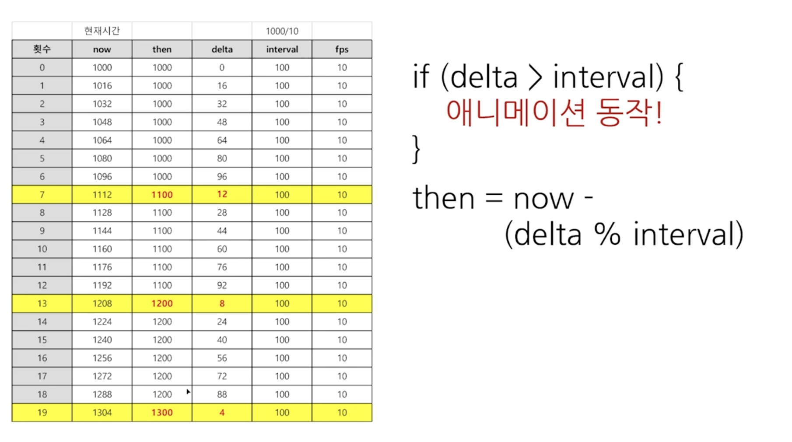
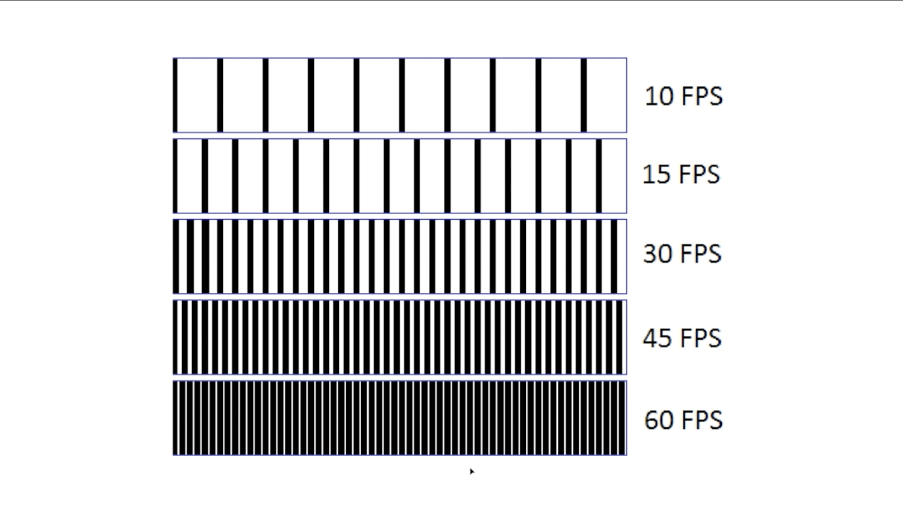

# 캔버스 파티클 다루기

## 캔버스 사이즈 이해하기

### DPR

dpr(Device Pixel Ratio) : 하나의 css 픽셀을 그릴 때 사용하는 장치의 픽셀 수

dpr이 높을수록 선명한 그래픽을 보여줄 수 있습니다.

### DRP scaling

dpr이 1일 경우 아무런 변화가 없습니다.

dpr이 2 이상일 경우, 

캔버스 자체에 dpr을 곱해주면 다음과 같습니다.

여기에 scaling까지 적용해줍니다.

여기에 css까지 캔버스 크기에 맞춰줍니다. 
더욱 잘게 쪼개져 선명해집니다.

### 전체코드

[전체 코드](./code_1.js) 

## 파티클 그리기

원을 그릴 때는 beginPath, closePath를 사용합니다. 
애니메이션을 그리려면 단순히 그리는 것에서 끝나면 안 됩니다. 
프레임마다 그려서 x,y 좌표를 잡아줘야 합니다. 

[예시 코드](./code_2.js) 

보통 클래스 인스턴스를 통해 그림을 관리합니다. 
이렇게 작성한 그림 코드를 클래스로 관리해 프레임마다 그려줘야 애니메이션을 완성할 수 있습니다.

### 전체코드

[전체코드](./c3.js) 

## 파티클 인스턴스를 바탕으로 애니메이션 구현하기

### requestAnimationFrame 효율적으로 사용하기

req를 무한히 실행하면 1프레임에 몇번 찍힐까? 
현재 모니터의 주사율에 따라 다르게 나옵니다.

일반적으로 게임 모니터는 144hz이므로, req에서는 1초에 144번 실행된다는 의미입니다. 
회사용 모니터나 일반 모니터는 보통 60Hz의 주사율을 가지고 있습니다.

그럼 animate 함수 안에서 1초에 x를 1px 이동시킨다고 하면, 모니터마다 이동속도가 다르다는 걸 의미한다. 
모니터에 상관없이 속도를 일관되게 하려면 fps에 대해 알아야 합니다. 
fps는 frame per second의 약자입니다. 
우리 코드로 이해하자면, 1초에 animate 함수를 requestAnimationFrame로 몇번 실행할지 결정하는 걸 말합니다.

requestAnimationFrame은 계속 실행되더라도, interval 함수를 사용해서 주기를 제어하는 방법을 사용할 수 있습니다.

Date.now가 16씩 증가하고, now에서 then을 뺀 값이 Delta 값입니다. Delta 값이 interval보다 커지는 시점이 노란색입니다. 
이 조건이 성립했을 때 애니메이션을 실행하면 100ms마다 애니메이션을 실행하라는 애니메이션 조건을 만족시킬 수 있습니다. 
애니메이션을 실행하고, 다시 then 값을 초기화해줍니다.

- 1000/10이라는 건 1초마다 10번 실행한다는 의미이므로 10fps를 목표로 하는 개념입니다.

이렇게 하면 모든 모니터에서 동일한 시간에 동일한 움직임(부드러움의 차이는 어쩔 수 없습니다)을 보여줄 수 있습니다. 
다만 10fps 보다는 60fps가 더 빈번하게 찍어내므로 움직임이 더 자연스럽게 됩니다. 
요즘은 아무리 못해도 60fps는 되므로 60fps를 기준으로 합니다.

### 애니메이션 구현

[예제 코드](./c4.js)
