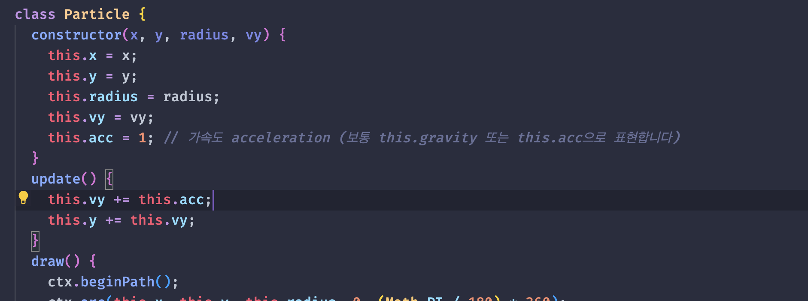
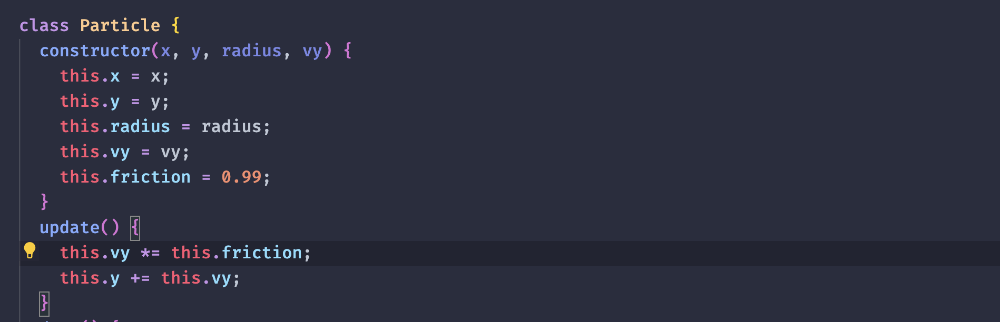
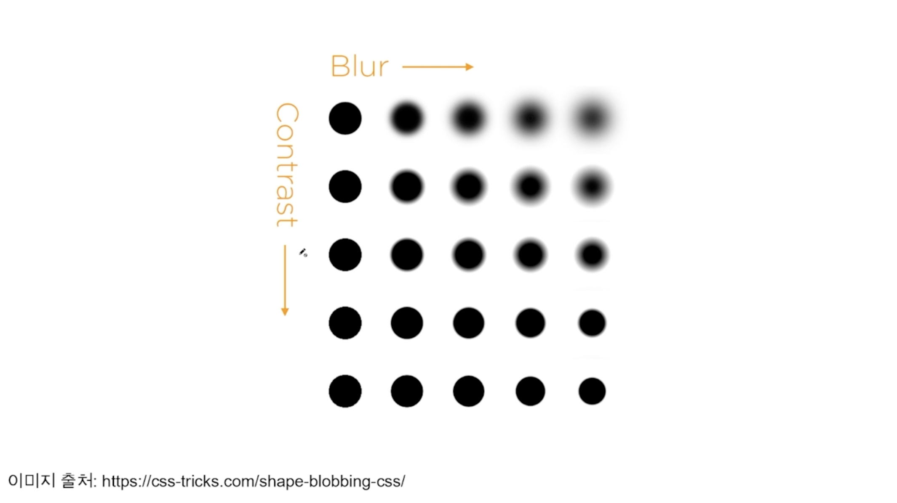
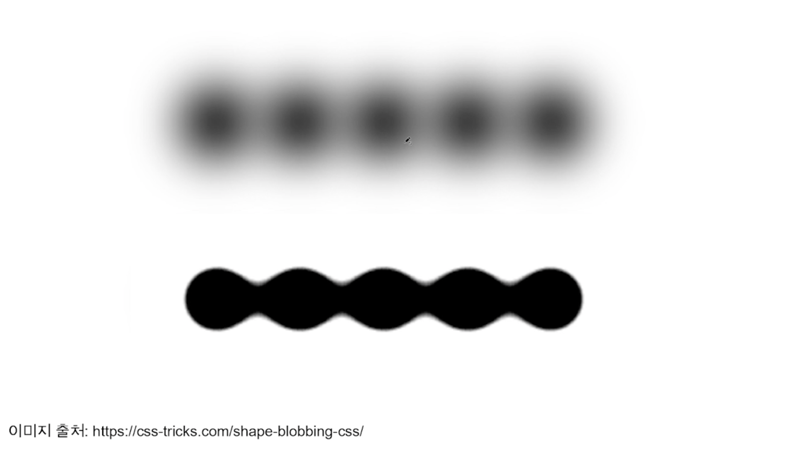
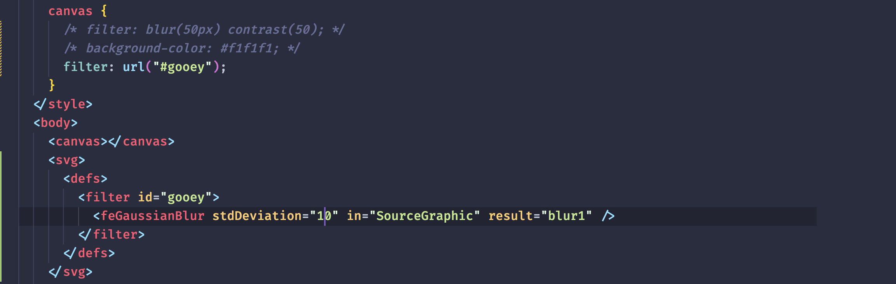
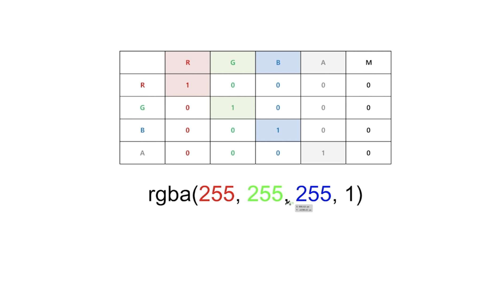
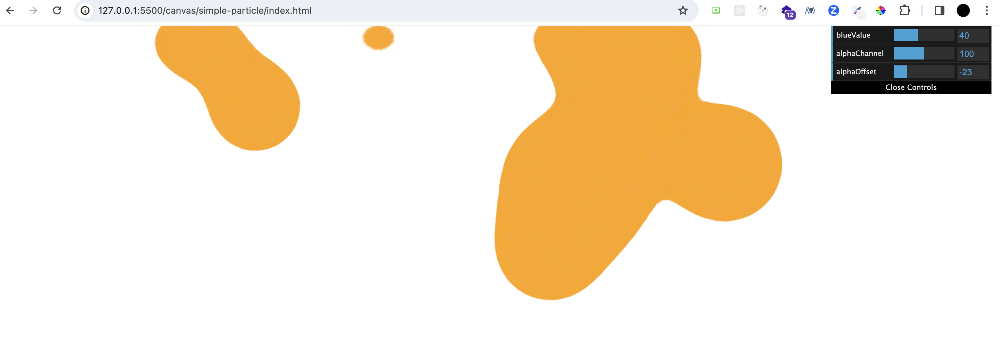
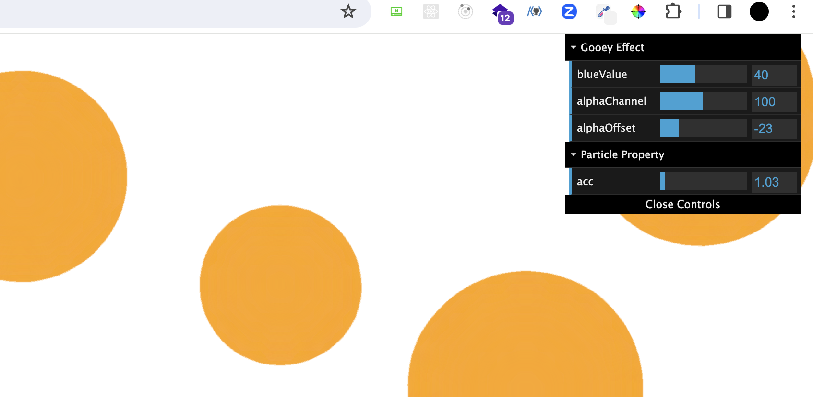

# 캔버스 파티클 다루기

## 캔버스 사이즈 이해하기

### DPR

dpr(Device Pixel Ratio) : 하나의 css 픽셀을 그릴 때 사용하는 장치의 픽셀 수

dpr이 높을수록 선명한 그래픽을 보여줄 수 있습니다.


### DRP scaling

dpr이 1일 경우 아무런 변화가 없습니다.


dpr이 2 이상일 경우,<br>

캔버스 자체에 dpr을 곱해주면 다음과 같습니다.


여기에 scaling까지 적용해줍니다.


여기에 css까지 캔버스 크기에 맞춰줍니다.<br>
더욱 잘게 쪼개져 선명해집니다.


### 전체코드

[전체 코드](./code_1.js)<br>

## 파티클 그리기

원을 그릴 때는 beginPath, closePath를 사용합니다.<br>
애니메이션을 그리려면 단순히 그리는 것에서 끝나면 안 됩니다.<br>
프레임마다 그려서 x,y 좌표를 잡아줘야 합니다.<br>

[예시 코드](./code_2.js)<br>

보통 클래스 인스턴스를 통해 그림을 관리합니다.<br>
이렇게 작성한 그림 코드를 클래스로 관리해 프레임마다 그려줘야 애니메이션을 완성할 수 있습니다.

### 전체코드

[전체코드](./c3.js)<br>

## 파티클 인스턴스를 바탕으로 애니메이션 구현하기

### requestAnimationFrame 효율적으로 사용하기

req를 무한히 실행하면 1프레임에 몇번 찍힐까?<br>
현재 모니터의 주사율에 따라 다르게 나옵니다.

일반적으로 게임 모니터는 144hz이므로, req에서는 1초에 144번 실행된다는 의미입니다.<br>
회사용 모니터나 일반 모니터는 보통 60Hz의 주사율을 가지고 있습니다.

그럼 animate 함수 안에서 1초에 x를 1px 이동시킨다고 하면, 모니터마다 이동속도가 다르다는 걸 의미한다.<br>
모니터에 상관없이 속도를 일관되게 하려면 fps에 대해 알아야 합니다.<br>
fps는 frame per second의 약자입니다.<br>
우리 코드로 이해하자면, 1초에 animate 함수를 requestAnimationFrame로 몇번 실행할지 결정하는 걸 말합니다.


requestAnimationFrame은 계속 실행되더라도, interval 함수를 사용해서 주기를 제어하는 방법을 사용할 수 있습니다.

Date.now가 16씩 증가하고, now에서 then을 뺀 값이 Delta 값입니다. Delta 값이 interval보다 커지는 시점이 노란색입니다.<br>
이 조건이 성립했을 때 애니메이션을 실행하면 100ms마다 애니메이션을 실행하라는 애니메이션 조건을 만족시킬 수 있습니다.<br>
애니메이션을 실행하고, 다시 then 값을 초기화해줍니다.

- 1000/10이라는 건 1초마다 10번 실행한다는 의미이므로 10fps를 목표로 하는 개념입니다.


이렇게 하면 모든 모니터에서 동일한 시간에 동일한 움직임(부드러움의 차이는 어쩔 수 없습니다)을 보여줄 수 있습니다.<br>
다만 10fps 보다는 60fps가 더 빈번하게 찍어내므로 움직임이 더 자연스럽게 됩니다.<br>
요즘은 아무리 못해도 60fps는 되므로 60fps를 기준으로 합니다.


### 애니메이션 구현

[예제 코드](./c4.js)

## 파티클에 가속도 주기

이번에는 파티클의 이동거리와 속도 뿐만 아니라 가속도를 줍니다.<br>
즉, 매 프레임마다 속도에 일정값을 더하거나 곱해서 파티클이 더 빠르거나 느리게 만들어줍니다.

공이 더 빨라지는 이유는 중력에 영향을 받아 떨어지는 속도가 점점 빨라지기 때문입니다.



속도를 처음에는 더 느렸다가, 시간이 지날수록 더 가파르게 하려면 1씩 더하는 게 아니라, 1 이상의 값을 곱해주면 됩니다.

1 이하의 값을 곱해주면, 마치 자동차가 브레이크를 밟는 것과 같은 효과를 줍니다.<br>
1 이하의 값을 무한히 곱해주면 0으로 수렴하기 때문입니다.<br>
마찰과 같은 개념인데, 이건 `this.friction`이라는 변수로 일반적으로 관리합니다.



## SVG 필터 입히기

gooey effect를 구현합니다.



blur 효과와 contrast 효과를 함께 사용합니다.<br>
위 이미지에서 blur와 contrast 사이의 (i,i) 좌표들을 보면 blur 값이 높아져도 선명한 걸 볼 수 있습니다.<br>
blur 처리가 되면서 불투명해지는 영역, 즉 알파값이 들어간 요소에 대비값을 높여주므로 알파값이 사라지고 선명해지는 것입니다.

이때 요소가 여러 개라면? 아래 그림처럼, 젤리처럼 연결되는 부분이 생깁니다.



### CSS에서 제공하는 blur, contrast를 사용합니다.

gooey effect가 구현되었지만, contrast 때문에 색상이 대비되어 변질됩니다.

```css
canvas {
  filter: blur(50px) contrast(50);
  background-color: #f1f1f1;
}
```

### 커스텀 필터를 제작합니다.

일반 css filter가 아닌 svg 안에서 가지고 있는 필터 속성을 활용해,<br>
css filter에 우리가 적용한 커스텀 필터를 입힙니다.

`svg 태그의 defs 태그`는 재사용할 수 있도록 요소들을 정의할 때 사용됩니다.<br>
이곳에 blur나 각종 filter들을 정의할 수 있고, 또는 Clipping Mask처럼 svg를 마스킹처리할 때, 마스킹 처리할 영역 또한 이곳에서 정의할 수 있습니다.<br>
또한 circle이나 rect 같은 태그들을 직접 svg에 넣어서 바로 사용하는 게 아니라 마치 React에서 재사용 컴포넌트를 만들듯이 이곳에서 다양하게 그려진 형태들을 미리 정의만 해둘 수도 있습니다.

defs 안에 재사용 가능한 filter를 만들어봅시다.<br>
해당 filter의 id를 설정해주고, blur effect를 먼저 넣을 건데<br>
사용될 svg filter 중 하나가 `feGaussianBlur`라는 태그입니다. 보통 필터들을 정의하는 태그는 앞에 `fe`가 붙습니다.

기존 css filter에서는 blur 값이 px에 따라 변했으나, `feGaussianBlur`에서는 `stdDeviation` 값에 영향을 받습니다.<br>
stdDeviation 안에는 숫자를 1개 또는 2개를 넣을 수 있습니다.<br>
2개를 넣을 경우, 첫번째 값은 가로 blur 두번째 값은 세로 blur를 담당합니다.<br>
1개를 넣을 경우, x와 y를 동시에 변경해 우리가 일반적으로 사용하는 css filter의 blur와 같습니다.

- 이미지 슬라이더 속도가 빠르게 하기 위해 stdDeviation의 가로 blur 값만 활용해서 이미지 슬라이더를 만드는 예제도 있으므로 학습해보면 좋습니다.

stdDeviation값을 주고, 이 필터가 어디에 적용될 건지도 값을 부여해줘야 합니다.

- 기본적으로 in attribute에 "SourceGraphic"을 부여하면, 오리지널 그래픽에 부여해 필터가 정의돼 사용되는 캔버스 엘리먼트에 직접 적용됩니다.
- result attribute에는 "blur1" 값을 주면, 이 필터의 이름을 blur1이라고 정의합니다.

이렇게 만든 커스텀 필터를 사용하려면, css에서 `filter: url('#id');` 형식으로 가져오면 됩니다.



이제 blur를 적용했으니 contrast만 적용하면 됩니다.<br>
`feColorMatrix` 태그를 사용합니다.

feColorMatrix 태그의 in attribute을 캔버스가 아니라, 방금 만든 "blur1"로 설정해주면,<br>
feColorMatrix에서 정의한 값을 캔버스 전체가 아닌, blur에만 적용할 수 있습니다.

mode attribute은 여러가지 값 중에서 matrix로 부여합니다.<br>
`5*4` 행렬 형태로 된 매트릭스 값 안에서 일부 값만 수정해줍니다.

- values attribute에서 이 매트릭스 값을 입력해줍니다.
- `1 0 0 0 0  0 1 0 0 0  0 0 1 0 0  0 0 0 1 0`과 같이 매트릭스 값을 정의해줄 수 있습니다.

아래가 기본값이므로 이렇게만 입력하면 아무런 변화가 없습니다.

```html
<feColorMatrix
  in="blur1"
  mode="matrix"
  values="1 0 0 0 0  0 1 0 0 0  0 0 1 0 0  0 0 0 1 0"
/>
```

이 중에서 마지막 두 값만 수정해줍니다.<br>
예를 들어 `values="1 0 0 0 0  0 1 0 0 0  0 0 1 0 0  0 0 0 20 -3"`.

원리는 다음과 같습니다.

기본 매트릭스 형태는 다음과 같습니다. 우리가 아는 흰색 형태입니다.

- 앞의 3가지는 rgb이고, 마지막 2개의 값을 통해 투명도와 대비 값이 변경됩니다.
- 이 2가지 값만 변경하면, 색상은 변경하지 않고도 gooey 효과를 줄 수 있습니다.



https://yoksel.github.io/svg-filters/#/ 이 사이트에서 필터를 테스트해볼 수 있습니다.

## dat.GUI 활용하기

dat.GUI 라이브러리를 사용하면, 값을 쉽게 테스트해볼 수 있습니다.

- svg blur, alpha contrast 값 뿐만 아니라 escalation 값까지 조절해 이상적인 애니메이션을 구현할 수 있습니다.

cdn으로 라이브러리를 가져옵니다. https://cdnjs.com/libraries/dat-gui

dat gui 컨트롤 패널 안에서 변화를 주기 위한 값들을 먼저 정의해줘야 합니다.

```js
const feGaussianBlur = document.querySelector("feGaussianBlur");
const feColorMatrix = document.querySelector("feColorMatrix");

// 앞서 커스텀 필터를 만들 때 주입한 값들을 초기값으로 설정합니다.
const controls = {
  blueValue: 40,
  alphaChannel: 100,
  alphaOffset: -23,
};

let gui = new dat.GUI();

// 4가지 인자를 넣어줍니다.
// controls의 blueValue를 최소0 최대100 사이에서 테스트해본다는 의미입니다.
gui.add(controls, "blueValue", 0, 100).onChange((value) => {
  // 여기서 svg 요소를 가져와서 실시간으로 반영하도록 합니다.
  feGaussianBlur.setAttribute("stdDeviation", value);
});
gui.add(controls, "alphaChannel", 1, 200).onChange((value) => {
  feColorMatrix.setAttribute(
    "values",
    `1 0 0 0 0  0 1 0 0 0  0 0 1 0 0  0 0 0 ${value} ${controls.alphaOffset}`
  );
});
gui.add(controls, "alphaOffset", -40, 40).onChange((value) => {
  feColorMatrix.setAttribute(
    "values",
    `1 0 0 0 0  0 1 0 0 0  0 0 1 0 0  0 0 0 ${controls.alphaChannel} ${value}`
  );
});
```

아래와 같이 개발자도구에서 우측상단에 값을 조절해줄 수 있는 컨트롤 패널이 등장합니다.



3가지 값들을 움직여 보면서 자연스러운 애니메이션을 찾습니다.

3가지 값들 외에 기존에 작성했던 파티클들의 속성값들도 테스트해볼 수 있습니다.

acc를 테스트하려면 다음과 같습니다.

```js
const controls = {
  blueValue: 40,
  alphaChannel: 100,
  alphaOffset: -23,
  acc: 1.03, // acc를 controls에 추가합니다.
};

// 5번째 인자는 스텝입니다. 얼마만큼 변화를 줄것인지에 관한 값입니다.
gui.add(controls, "acc", 1, 1.5, 0.01).onChange((value) => {
  particles.forEach((particle) => (particle.acc = value));
});
```

지금까지 보면, 위 3개는 gooey effect 관련이고, 아래는 particle의 acc이므로 관심사를 분리해볼 수 있습니다.

```js
let gui = new dat.GUI();

const f1 = gui.addFolder("Gooey Effect");
const f2 = gui.addFolder("Particle Property");

// 4가지 인자를 넣어줍니다.
// controls의 blueValue를 최소0 최대100 사이에서 테스트해본다는 의미입니다.
f1.add(controls, "blueValue", 0, 100).onChange((value) => {
  // 여기서 svg 요소를 가져와서 실시간으로 반영하도록 합니다.
  feGaussianBlur.setAttribute("stdDeviation", value);
});
f1.add(controls, "alphaChannel", 1, 200).onChange((value) => {
  feColorMatrix.setAttribute(
    "values",
    `1 0 0 0 0  0 1 0 0 0  0 0 1 0 0  0 0 0 ${value} ${controls.alphaOffset}`
  );
});
f1.add(controls, "alphaOffset", -40, 40).onChange((value) => {
  feColorMatrix.setAttribute(
    "values",
    `1 0 0 0 0  0 1 0 0 0  0 0 1 0 0  0 0 0 ${controls.alphaChannel} ${value}`
  );
});
// 5번째 인자는 스텝입니다. 얼마만큼 변화를 줄것인지에 관한 값입니다.
f2.add(controls, "acc", 1, 1.5, 0.01).onChange((value) => {
  particles.forEach((particle) => (particle.acc = value));
});
```



`f1.open();`을 실행하면 폴더가 항상 열린 채로 존재합니다.

## 캔버스 resize 다루기

화면 크기가 변했을 때, 자동으로 resize되도록 합니다.

자바스크립트를 로드했을 때, 사이즈를 고정으로 입력했기 때문입니다.<br>
resize 이벤트 발생 시마다 사이즈를 동적으로 할당하면 됩니다.

아래와 같이 기존 코드를 수정합니다.

```js
let canvasWidth;
let canvasHeight;
let particles;

function init() {
  // 관련 사이즈 코드를 init 함수 내부로 옮깁니다.
  canvasWidth = innerWidth;
  canvasHeight = innerHeight;

  canvas.style.width = canvasWidth + "px";
  canvas.style.height = canvasHeight + "px";

  canvas.width = canvasWidth * dpr;
  canvas.height = canvasHeight * dpr;
  ctx.scale(dpr, dpr);

  particles = [];
  const TOTAL = canvasWidth / 30; // TOTAL도 20이 아니라 동적으로 변경되도록 합니다.
  for (let i = 0; i < TOTAL; i++) {
    const x = randomNumBetween(0, canvasWidth);
    const y = randomNumBetween(0, canvasHeight);
    const vy = randomNumBetween(1, 5);
    const radius = randomNumBetween(50, 100);
    const particle = new Particle(x, y, radius, vy);
    particles.push(particle);
  }
}

window.addEventListener("load", () => {
  init();
  animate();
});
window.addEventListener("resize", () => {
  init();
});
```
